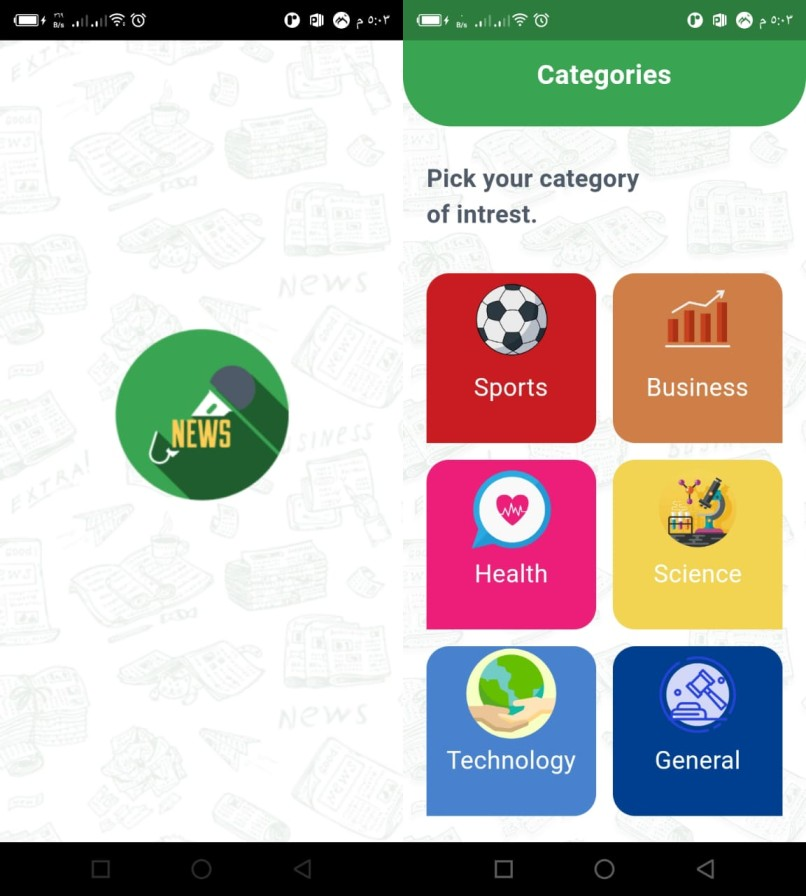
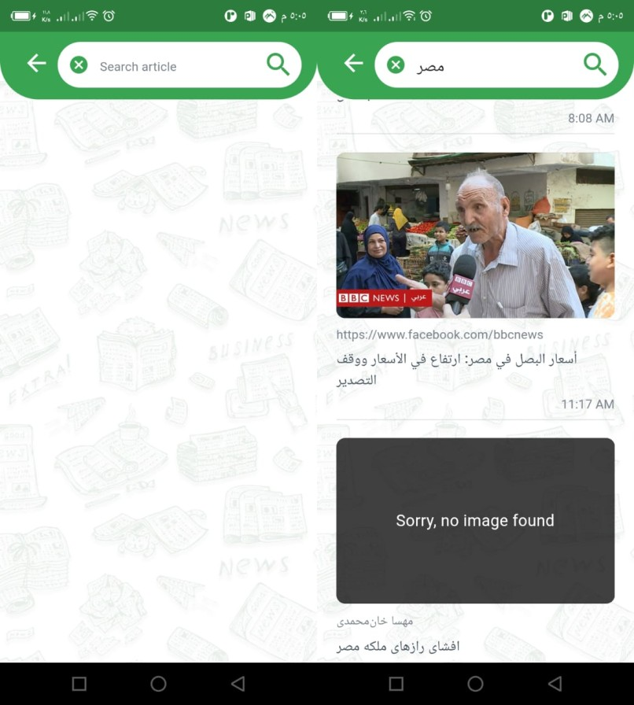

# Route News App
The Third app from [Route Academy](https://www.facebook.com/Routelearning) News app using Flutter and the Api provided from [News Api](https://newsapi.org/).

### What did I learn?
1. New Widgets
2. How to work with third party APIs and use http package to consume 
3. Understand the different formats of Json file
4. Implement pagination
5. Using more the one endpoint for the same API
6. How to use Webview to view URLs
7. How to handle invalid URL Image using CachedNetworkImage
8. Structure the code properly

### Screenshots

------------------------------------------

------------------------------------------

